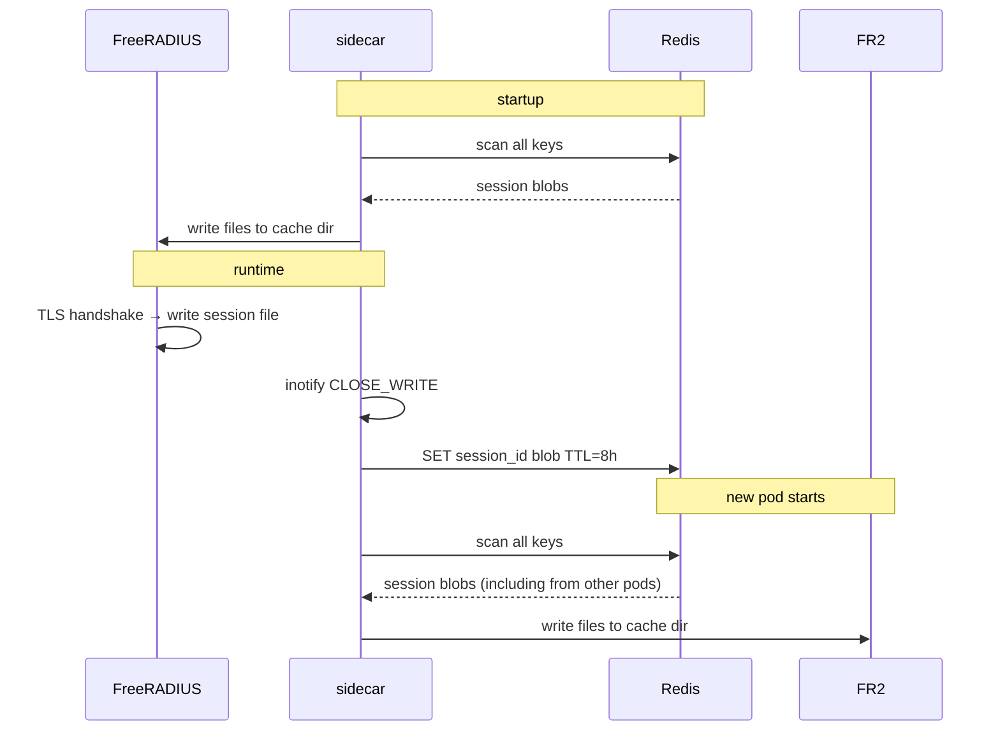

# fr3-tlscache-redis

Kubernetes sidecar that gives FreeRADIUS 3.x shared TLS session resumption across multiple pods via Redis.

## The problem

FreeRADIUS 3.x persists TLS session cache entries as files on the local filesystem (`rlm_eap_tls`). In a single-pod deployment this works fine. With multiple replicas, each pod has an isolated cache: a client that authenticates against pod A and reconnects to pod B must re-authenticate from scratch, adding a full EAP round-trip on every reconnect.

FreeRADIUS 4.x adds native Redis-backed session caching. This sidecar backports that capability to FR3 without any changes to the FreeRADIUS configuration beyond the cache directory path.

## How it works



On startup the sidecar pulls all existing sessions from Redis into the local cache directory. At runtime it watches the directory with inotify and pushes any new session file to Redis with a configurable TTL.

## Deployment

Run as a sidecar container sharing a volume with the FreeRADIUS container:

```yaml
volumes:
  - name: tls-cache
    emptyDir: {}

containers:
  - name: freeradius
    image: freeradius/freeradius-server:3.2
    volumeMounts:
      - name: tls-cache
        mountPath: /var/log/freeradius/tlscache

  - name: tlscache-sidecar
    image: ghcr.io/Quxyzzy/fr3-tlscache-redis:latest
    env:
      - name: REDIS_HOST
        value: "redis.default.svc.cluster.local"
      - name: REDIS_PORT
        value: "6379"
      - name: REDIS_DB
        value: "0"
      - name: SESSION_TTL
        value: "28800"   # 8 hours, match your EAP session lifetime
      - name: PERSIST_DIR
        value: "/var/log/freeradius/tlscache"
    volumeMounts:
      - name: tls-cache
        mountPath: /var/log/freeradius/tlscache
```

Configure FreeRADIUS `rlm_eap_tls` to use the same path as `PERSIST_DIR`:

```text
tls {
    ...
    cache {
        enable = yes
        lifetime = 8h
        store = "/var/log/freeradius/tlscache"
    }
}
```

## Configuration

| Variable | Default | Description |
|----------|---------|-------------|
| `PERSIST_DIR` | `/var/log/freeradius/tlscache` | Path to the FreeRADIUS TLS session cache directory |
| `REDIS_HOST` | `freeradius-redis.freeradius.svc.cluster.local` | Redis hostname |
| `REDIS_PORT` | `6379` | Redis port |
| `REDIS_DB` | `2` | Redis database index |
| `SESSION_TTL` | `28800` | Session TTL in seconds (should match EAP session lifetime) |

## Building

```bash
docker build -t fr3-tlscache-redis .
```

## Verification

After deploying multiple replicas, authenticate a client, then force-reconnect it to a different pod. With the sidecar running you should see a TLS session resumption in the FreeRADIUS logs (`TLS Resuming session`) rather than a full re-authentication.
